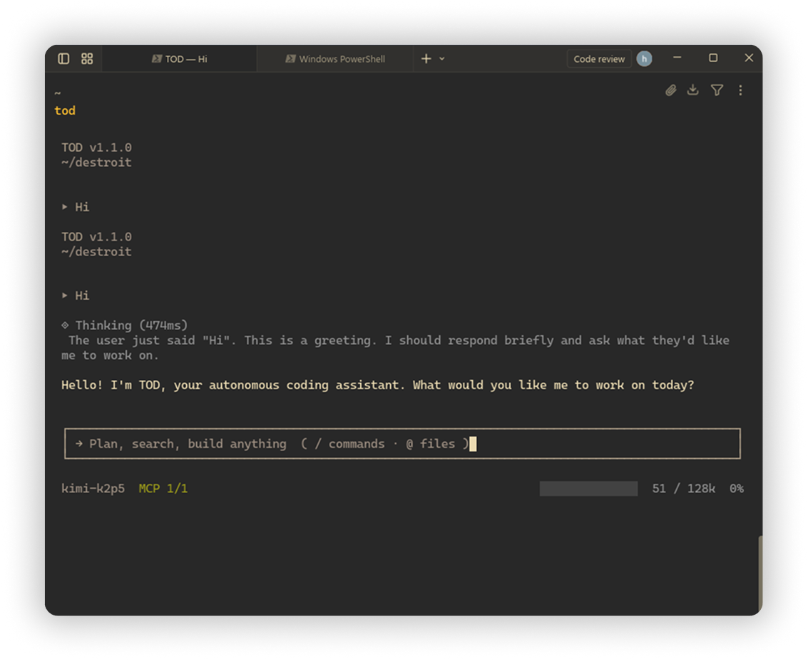

# TOD

<p align="center">
  
</p>

<p align="center">
  <b>An AI agent that lives in your terminal and codes for you.</b>
</p>

<p align="center">
  <a href="https://github.com/todlabs/tod/releases">
    
  </a>
  <a href="https://github.com/todlabs/tod/blob/main/LICENSE">
    
  </a>
  <a href="https://bun.sh/">
    
  </a>
  <a href="https://github.com/todlabs/tod/actions">
    
  </a>
</p>

<p align="center">
  <a href="#features">Features</a> •
  <a href="#installation">Installation</a> •
  <a href="#first-run">First Run</a> •
  <a href="#usage">Usage</a> •
  <a href="#configuration">Configuration</a> •
  <a href="#commands">Commands</a> •
  <a href="#mcp-model-context-protocol">MCP</a>
</p>

---

## Features

- **Natural language commands** — Just describe what you want in plain English
- **File @-mentions** — Reference files with `@filename` for context-aware responses
- **Slash commands** — Quick access with `/provider`, `/model`, `/clear`, and more
- **Background tasks** — Execute long-running operations without blocking your workflow
- **Multi-provider support** — Works with OpenAI, Anthropic, Fireworks, OpenRouter, and more
- **Terminal-native** — Built with React + Ink for a smooth TUI experience
- **Guided setup** — First launch walks you through provider and API key configuration

## Installation

```bash
# Clone
git clone https://github.com/todlabs/tod.git
cd tod

# Install dependencies
bun install

# Build
bun run build

# Run
bun run start
```

## First Run

On first launch, TOD will detect that no API key is configured and automatically open the provider selection menu. Follow the prompts:

1. **Select a provider** — Choose from Fireworks, OpenAI, Anthropic, OpenRouter, etc.
2. **Enter your API key** — Paste your key (it's stored locally in `~/.tod/config.json`)
3. **Select a model** — Pick from the provider's available models

Once configured, you're ready to go. You can always change provider/model later with `/provider` or `/model`.

## Usage

Start TOD in your project directory:

```bash
tod
```

Then just type what you need:

```
> Create a React component for a login form
> @src/utils.js refactor this to use async/await
> /clear
```

## Configuration

TOD stores config in `~/.tod/config.json`:

```json
{
  "activeProvider": "openai",
  "providerConfigs": {
    "openai": {
      "apiKey": "sk-...",
      "baseURL": "https://api.openai.com/v1",
      "model": "gpt-4o-mini",
      "maxTokens": 16384,
      "temperature": 1
    }
  }
}
```

Or use the interactive menus: `/provider` to change provider, `/model` to change model.

## Commands

| Command | Description |
|---------|-------------|
| `/provider` | Select LLM provider & set API key |
| `/model` | Select model for current provider |
| `/thinking` | Toggle thinking display |
| `/clear` | Clear conversation history |
| `/compact` | Compress context |
| `/mcp` | Show active MCP servers |
| `/help` | Show commands |
| `/exit` | Exit TOD |

> Aliases: `/providers` and `/models` also work.

## MCP (Model Context Protocol)

TOD supports MCP to connect to external tools and services. See documentation:

- [English](docs/mcp/README.md)
- [Русский](docs/mcp/README.ru.md)
- [Deutsch](docs/mcp/README.de.md)
- [Français](docs/mcp/README.fr.md)

## Requirements

- Bun 1.0+
- API key for your chosen LLM provider

## License

MIT
